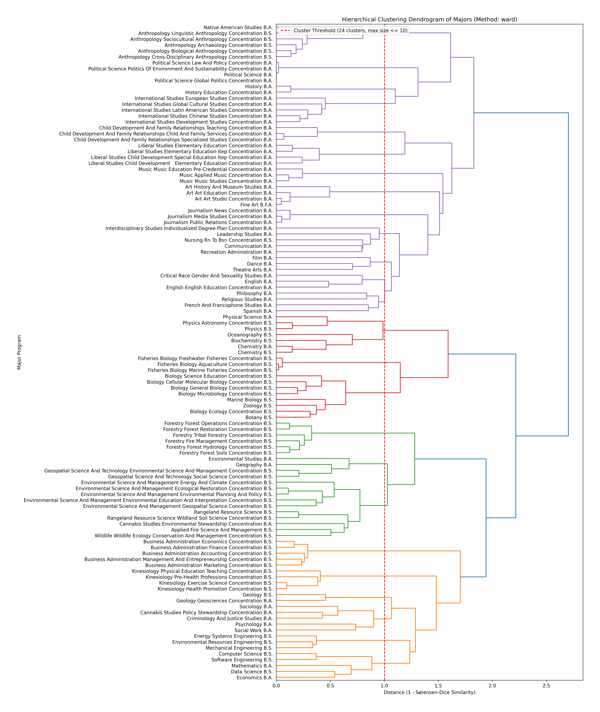

# Major recommender (content-based, unsupervised)

Starter code and sample data for a project-based introduction to unsupervised learning in which students build a content-based academic major recommender from public course catalog information. The pipeline uses word frequencies, pairwise similarity (Sørensen–Dice), hierarchical clustering, and a small interactive explorer.

This repository is intended for instructors who want a concrete, end-to-end assignment students can relate to (choosing a major) while wrestling with the challenge of learning without labels, design trade-offs, and ethical and transparency considerations.

## Sample output

<p align="center">

</p>

<p align="center"><em>Sample dendrogram from the bundled catalog data, produced by <code>project/code/cluster_majors.py</code>. The red dashed line marks a distance threshold so no cluster exceeds ten majors.</em></p>

**What’s in this repo:** `project/` holds a student-facing pipeline (code, data, generated outputs) and `project/student_assignments/` (Parts 1–3, tutorial, screenshot). The **`supplemental_lecture_lab_materials/`** folder is optional material for the teacher.  Everything else you need to get started as a teacher is in **Adapting this project to your campus** and the **Suggested teaching sequence** below.

| Path | Purpose |
|------|--------|
| `project/` | Student major-recommender bundle. |
| `supplemental_lecture_lab_materials/` | Optional instructor-facing learning outcomes, activities, and readings for labs and lectures. |

## Suggested teaching sequence

I teach a 15 week course that meets for three 50 minute lectures and one one hour and 40 minute lab each week.  I use the lecture time of weeks 1-6 for unsupervised learning and lecture of weeks 7-15 for supervised learning.  There is some overlap for the students as they work on applying what they've learned about unsupervised techniques to design a major recommender while I introduce new concepts in supervised learning in weeks 7-11. I keep the workload in lab and homework for supervised learning relatively low turning this time period. I generally have a midterm at the end of Week 6 or beginning of Week 7 on unsupervised learning and a final exam that covers supervised learning after Week 15. 

| Week | Material | Comment |
|------|----------|--------|
| 1 | [Lab 1](supplemental_lecture_lab_materials/Lab1_data_wrangling_plots_learning_outcomes.md) | Lab 1 — review of data wrangling and plot creation |
| 2 | [Lab 2](supplemental_lecture_lab_materials/Lab2_kmeans_learning_outcomes.md) | Lab 2 — k-means |
| 3 | [Lab 3](supplemental_lecture_lab_materials/Lab3_hclustering_learning_outcomes.md) | Lab 3 — hierarchical clustering and dendrograms |
| 3 | [Lecture (similarity)](supplemental_lecture_lab_materials/lecture_distance_similarity_metrics_toy_examples_learning_outcomes.md) | Lecture — options for computing similarity/dissimilarity |
| 4 | [Lecture (recommenders)](supplemental_lecture_lab_materials/lecture_recommender_systems_history_modern_context_learning_outcomes.md) | Lecture — introduction to recommender systems, before Lab 4|
| 4 | [Lab 4](supplemental_lecture_lab_materials/Lab4_mini_project_study_group_recommender.md) | Lab 4 — study-group recommender mini-project |
| 5 | [Lecture (text clustering)](supplemental_lecture_lab_materials/lecture_intro_text_data_clustering_activity.md) | Lecture — introduction to clustering text data|
| 5 | [Lab 5](supplemental_lecture_lab_materials/Lab5_study_group_recommender_work_session.md) | Lab 5 — teamwork on the mini-project from Lab 4 |
| 5 | [Lecture (ethics)](supplemental_lecture_lab_materials/lecture_recommender_ethics_transparency_learning_outcomes.md) | Lecture — history of and ethical considerations in recommender systems, before Lab 6  |
| 6 | [Lab 6](supplemental_lecture_lab_materials/Lab6_evaluation_design_preference_data.md) | Lab 6 — evaluation design for the major recommender, before Part 1 |
| 6 | [Lecture (finalize metrics)](supplemental_lecture_lab_materials/lecture_class_selection_evaluation_metrics.md) | Lecture — whole class selects metrics from Lab 6, before Part 1 |
| 7 | [Lab 7: Tutorial](project/student_assignments/TUTORIAL_content_based_major_recommender.md) | Lab 7 - demostrate the sample recommender in lab then assign part 1 of the project|
| 7-8 | [Part 1](project/student_assignments/PART1_INSTRUCTIONS.md) | Project Part 1 — verify the provided code works, implement a minor change and evaluate |
| 9-10 | [Part 2](project/student_assignments/PART2_INSTRUCTIONS.md) | Project Part 2 — obtain a new dataset, make two minor changes and evaluate |
| 11 | [Part 3](project/student_assignments/PART3_REPORT.md) | Project Part 3 — describe your major recommender |
| 12-15 | - | Project 2 is planning, implementing and reporting a supervised method |

## Quick start to adapting this project to your campus and class

Follow these steps:

1. Try the sample recommender on your system. Work from the repository root (the folder that contains [`project/`](project/)). Read [the tutorial](project/student_assignments/TUTORIAL_content_based_major_recommender.md) for setup and folder layout. Install dependencies, download NLTK data as in the tutorial, then run:

   ```bash
   pip install pandas nltk scipy matplotlib wordcloud selenium webdriver-manager
   ```

   ```bash
   python project/code/calculate_word_frequencies.py
   python project/code/generate_wordclouds.py    # optional
   python project/code/cluster_majors.py
   python project/code/explore_clusters_interactive.py
   ```

2. Update the catalog CSVs for your institution. Place your files in `project/course_descriptions_auto/` using the format described in the tutorial. Obtain data by adapting `project/code/webscrap.py` or by asking a staff member with internal access for an export. Respect copyright, robots.txt, and site terms.

3. Update the rest of the code as needed for your data, paths, or any pipeline changes.

4. Edit the student-facing assignments under `project/student_assignments/`. Check your institution’s IRB if you plan to have students collect data from other people for evaluation purposes.

5. Build your own teaching sequence using the suggested teaching sequence table above as a guide, together with your textbook and the optional [`supplemental_lecture_lab_materials/`](supplemental_lecture_lab_materials/) as needed.


## License

# tbd

## Citation

## tbd

> Overholser, R. (submitted). *Learning Without Labels: Teaching Unsupervised Learning Through a Major Recommender Project.* 

Note: I'll update the citation with volume, issue, and DOI after publication.
